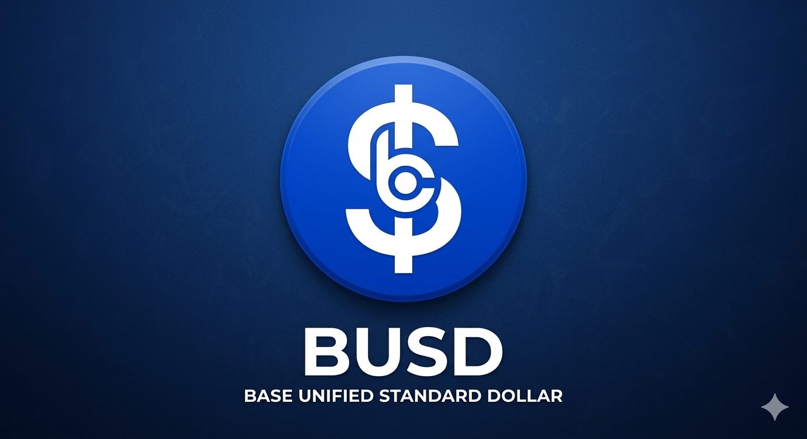

  

# 💎 Base Unified Standard Dollar (BUSD)

**The New Standard of Value on Base Mainnet.** Built in India for the Global DeFi Community. 🇮🇳🚀

---

## 🌐 Overview
**Base Unified Standard Dollar (BUSD)** is a decentralized, utility-first token deployed on the **Base Mainnet (Ethereum Layer 2)**. Our mission is to provide a scarcity-driven, secure, and transparent asset for the next billion users on-chain.

- **Network:** Base Mainnet
- **Ticker:** BUSD
- **Contract:** `0x25d34817D4205fE605b4C65Ed3Be83C85107d333`

---

## 🛠 Tokenomics
BUSD is designed with a strictly fixed supply to protect holders from inflation.

| Feature | Details |
| :--- | :--- |
| **Total Supply** | 1,000,000,000 BUSD |
| **Circulating Supply** | 1,000,000,000 BUSD |
| **Minting** | No New Tokens Can Be Created (Fixed) |
| **Buy / Sell Tax** | 0% |
| **Network** | Base (L2) |

---

## 🚀 Key Features
- **Zero Inflation:** With a 100% fixed supply, BUSD ensures long-term scarcity.
- **Ultra-Low Fees:** Powered by Base, transactions cost fractions of a cent.
- **Community Owned:** Developed as a grassroots project to strengthen the Indian presence in the Base ecosystem.
- **Verified Source:** The smart contract is fully verified on Basescan.

---

## 🔗 Official Links
- **Website:** [https://binnace.github.io/Base-united-standard-dollar/](https://binnace.github.io/Base-united-standard-dollar/)
- **Basescan:** [View on Basescan](https://basescan.org/token/0x25d34817D4205fE605b4C65Ed3Be83C85107d333)

---

## 🛡 Security & Transparency
BUSD is built on standard OpenZeppelin ERC20 contracts. The contract is immutable, meaning no one (not even the developers) can change the supply or tax after launch.

**"Build on Base. Lead with BUSD."**
